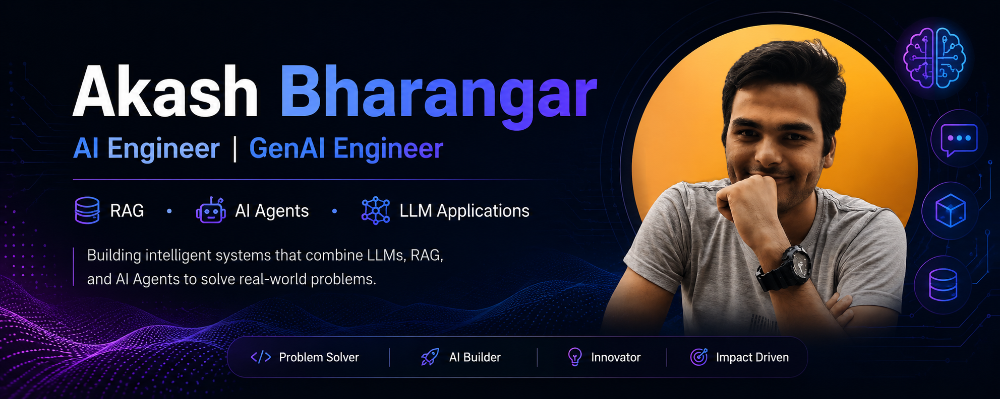

<p align="center">
  
</p>
<p align="center">
  
</p>
<p align="center">
  <a href="mailto:akashbharangar10@gmail.com">Email</a> •
  <a href="https://www.linkedin.com/in/akash-bharangar-757440186/">LinkedIn</a> •
  <a href="https://github.com/akashbharangar">GitHub</a> •
  <a href="https://x.com/akaaaaashhhhh">X/Twitter</a> •
  <a href="https://drive.google.com/drive/folders/182MYpC_CNeISP0jPAcrTV_zvnAxp2BKe">Resume</a>
</p>

# Hi, I'm Akash Bharangar 👋

### AI Engineer | GenAI Engineer | Building AI Agents, RAG Systems & Autonomous Workflows

I build production-ready AI systems powered by Large Language Models (LLMs), Retrieval-Augmented Generation (RAG), and Agentic AI workflows.

🚀 Open to AI Engineer, GenAI Engineer, LLM Engineer, and Agentic AI opportunities.

---

## 💡 About Me

* Computer Science Graduate (2024)
* Passionate about building AI products that solve real-world problems
* Experienced in developing RAG pipelines, AI agents, semantic retrieval systems, and LLM-powered applications
* Strong backend engineering foundation with REST APIs, databases, and scalable architectures
* Focused on production-ready AI systems rather than simple chatbot wrappers

---

## 🛠️ Tech Stack

### AI & LLMs


### Languages


### Backend & Databases


---

## 🚀 Featured Projects

### 🌐 Website Crawlr

AI-powered website knowledge extraction and RAG system that converts websites into searchable knowledge bases.

**Highlights**

* Automated website crawling and content extraction
* Semantic search using embeddings and vector retrieval
* ChromaDB-powered knowledge storage
* Context-aware retrieval for grounded responses
* End-to-end RAG architecture

**Tech**
`Python` `LangChain` `ChromaDB` `Sentence Transformers` `RAG`

---

### 🤖 Research Agent

Multi-agent AI research system that autonomously gathers, analyzes, and synthesizes information.

**Highlights**

* Tool-calling based agent workflows
* Automated web research pipeline
* Information extraction and synthesis
* Research quality review stage
* Modular multi-agent architecture

**Tech**
`Python` `LLMs` `AI Agents` `LangChain` `Prompt Engineering`

---

## 📈 What I'm Currently Learning

* Advanced RAG Architectures
* Agentic AI Systems
* Multi-Agent Orchestration
* MCP (Model Context Protocol)
* AI Evaluation Frameworks
* Production AI Infrastructure

---

## 📊 GitHub Stats

<p align="center">
  
</p>

<p align="center">
  
</p>

<p align="center">
  
</p>

---

## 🎯 Current Focus

```text
Building Production AI Systems

User
 ↓
Retriever
 ↓
Vector Database
 ↓
LLM
 ↓
Grounded Response
```

```text
Planner Agent
      ↓
Research Agent
      ↓
Reviewer Agent
      ↓
Final Output
```

---

## 📫 Connect With Me

📧 Email: [akashbharangar10@gmail.com](mailto:akashbharangar10@gmail.com)

💼 LinkedIn:
https://www.linkedin.com/in/akash-bharangar-757440186/

🐙 GitHub:
https://github.com/akashbharangar

🐦 X/Twitter:
https://x.com/akaaaaashhhhh

📄 Resume:
https://drive.google.com/drive/folders/182MYpC_CNeISP0jPAcrTV_zvnAxp2BKe

---

### Thanks for visiting my profile!

If you're building AI products, GenAI applications, or agentic systems, I'd love to connect and collaborate.
